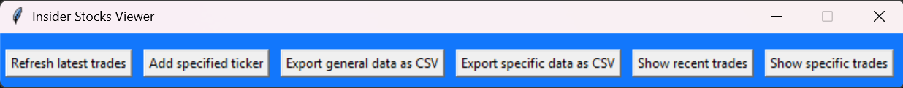
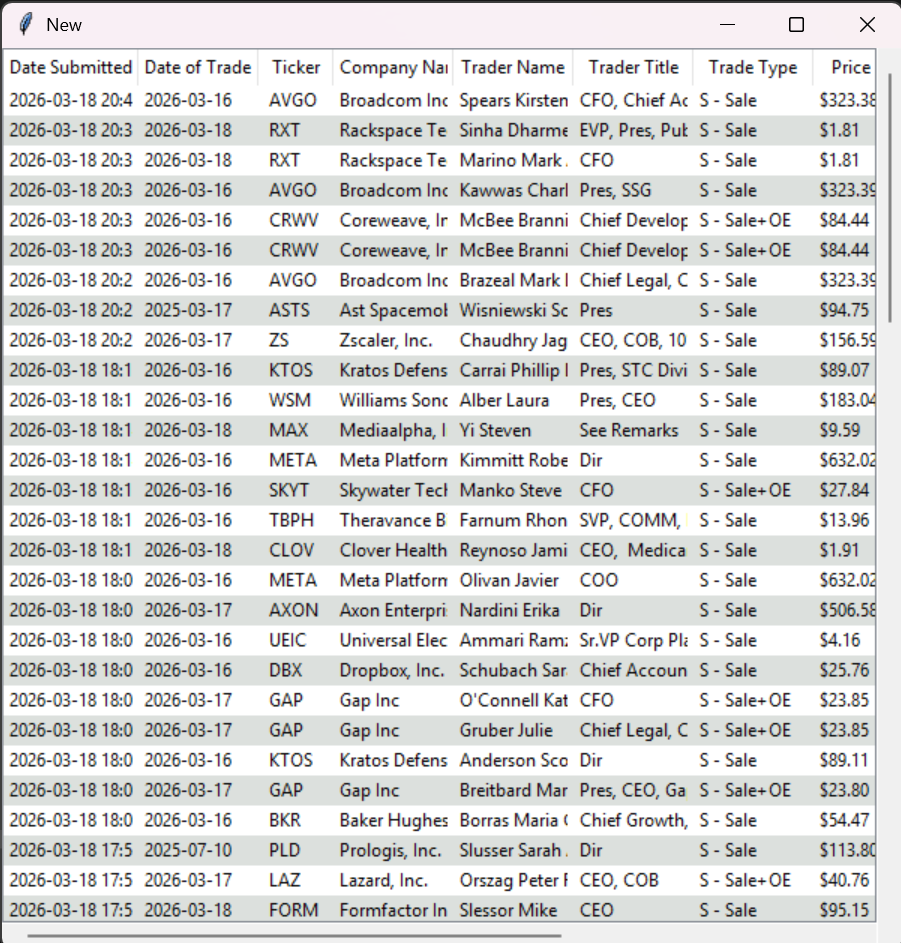
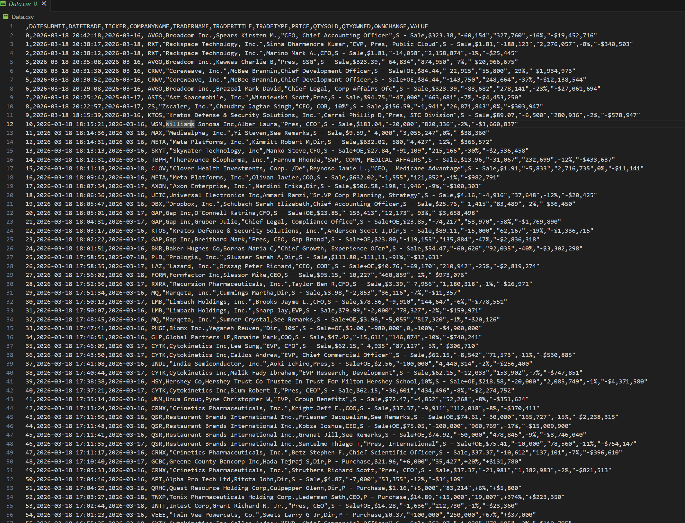
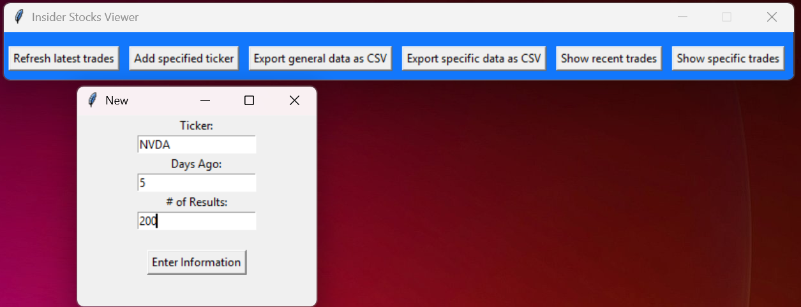
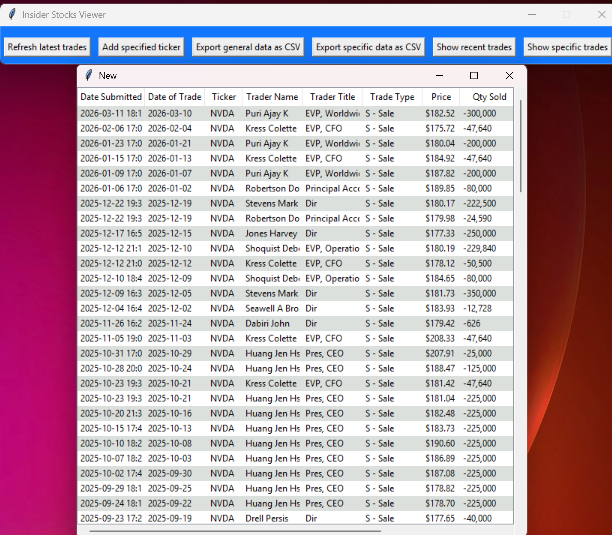

# Welcome to Stock-Tracker-App

## Overview

**Prominent Stock Tracker** is a desktop application that tracks and organizes stock trades and financial disclosures made by prominent individuals such as CEOs, executives, and politicians. It features an interactive user interface built with Tkinter and allows users to export collected data into `.csv` or `.json` formats for external analysis.

The app scrapes publicly available data using BeautifulSoup and stores structured trade records in a local SQL database. Users can explore trade histories and trends via an intuitive graphical UI.

## Key Features

- 🧾 **Data Collection**
  - Web scraping of public financial disclosure sites using `BeautifulSoup`
  - Parses trade and stock holding data from insider trading portals and government filings

- 💾 **Data Storage**
  - Trade and individual metadata stored in a local **SQL** database (SQLite or PostgreSQL)
  - Efficient querying and updates to ensure fast access

- 🖥️ **Interactive UI**
  - Built with `Tkinter` for a lightweight, responsive desktop experience
  - Search, sort, and filter records by name, company, or trade date

- 📤 **Data Export**
  - Export selected or full datasets as `.csv` or `.json` for further analysis or reporting

## Skills & Technologies

This project demonstrates practical experience with:

### 🐍 Python

- Web scraping with `BeautifulSoup (bs4)`
- UI development with `Tkinter`
- File I/O for `.csv` and `.json` exports
- SQL integration using `sqlite3` or `SQLAlchemy`

### 🗄️ Databases

- Designing relational schemas for financial data
- Querying, indexing, and updating records efficiently

### 📄 Data Handling

- Cleanly formatting scraped data into structured formats
- Exporting datasets to CSV/JSON while preserving schema and types

## Planned Future Additions

- Graphical charts using `matplotlib`.
- AI analysis and probability attached to trades for more informed decisions
- Auto-scheduler to re-scrape new data daily
- Alert system when new trades are detected

---
